# Keycloak service

``` Bash
# Install k3s disabling built-in configuration
curl -sfL https://get.k3s.io | INSTALL_K3S_EXEC='server --disable traefik' sh -
# Copy cofiguration
kubectl config view --raw > ~/.kube/config

# Create namespace for Keycloak
kubectl create namespace keycloak
```

## Installing Postgresql and Keycloak

---

In this section, we are going to use the HelmChart CRD defined within K3S. This CRD will automatically install any chart configuration stored in `/var/lib/rancher/k3s/server/manifests/` folder. For more information check here [K3S Helm charts](https://rancher.com/docs/k3s/latest/en/helm/).

``` Bash
# Create Helm controller configuration for Traefik that supports SSL
# Chart values for Traefik are available at
# https://github.com/helm/charts/blob/master/stable/traefik/values.yaml
echo "apiVersion: helm.cattle.io/v1
kind: HelmChart
metadata:
  name: traefik
  namespace: kube-system
spec:
  chart: stable/traefik
  valuesContent: |-
    rbac:
      enabled: true
    ssl:
      enabled: true
      enforced: true
      permanentRedirect: true
      generateTLS: true
      defaultCN: keycloak.keeptrack.xyz.209.182.238.54.nip.io
      defaultSANList:
        - keycloak.keeptrack.xyz.209.182.238.54.nip.io
        - registry.keeptrack.xyz.209.182.238.54.nip.io
        - demo-a.keeptrack.xyz.209.182.238.54.nip.io
        - demo-b.keeptrack.xyz.209.182.238.54.nip.io

    metrics:
      prometheus:
        enabled: true
    kubernetes:
      ingressEndpoint:
        useDefaultPublishedService: true
    tolerations:
      - key: \"CriticalAddonsOnly\"
        operator: \"Exists\"
      - key: \"node-role.kubernetes.io/master\"
        operator: \"Exists\"
        effect: \"NoSchedule\"" > traefik-chart.yaml

# Create Helm controller configuration for Postgres HA
# Chart values for Postgresql are available at
# https://github.com/bitnami/charts/blob/master/bitnami/postgresql-ha/values.yaml
echo "apiVersion: helm.cattle.io/v1
kind: HelmChart
metadata:
  name: keycloak-db
  namespace: keycloak
spec:
  repo: https://charts.bitnami.com/bitnami
  chart: postgresql-ha
  valuesContent: |-
    global:
      postgresql:
        username: keycloak
        password: keycloak
        database: keycloak
      storageClass: local-path" > postgres-ha-chart.yaml
cp postgres-ha-chart.yaml /var/lib/rancher/k3s/server/manifests/postgres-ha-chart.yaml

# Make sure that the postgres service is now available
kubectl -n keycloak get pods
kubectl -n keycloak get services
```

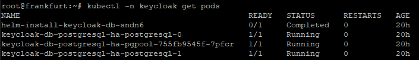
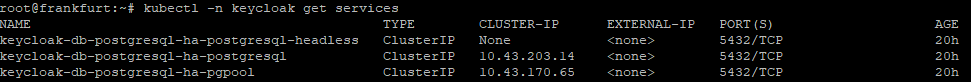

``` Bash
# Create Helm controller configuration for Keycloak chart
# Chart values for Keycloak are available at
# https://github.com/codecentric/helm-charts/blob/master/charts/keycloak/values.yaml
POSTGRES_SERVICE_NAME="keycloak-db-postgresql-ha-postgresql"
POSTGRES_SERVICE_IP=$(kubectl -n keycloak get service/$POSTGRES_SERVICE_NAME -o=jsonpath='{"\""}{.spec.clusterIP}{"\""}')
POSTGRES_SERVICE_PORT=$(kubectl -n keycloak get service/$POSTGRES_SERVICE_NAME -o=jsonpath='{"\""}{.spec.ports[?(@.name=="postgresql")].port}{"\""}')

echo "apiVersion: helm.cattle.io/v1
kind: HelmChart
metadata:
  name: keycloak
  namespace: keycloak
spec:
  repo: https://codecentric.github.io/helm-charts
  chart: keycloak
  valuesContent: |-
    replicas: 3
    postgresql:
      enabled: false
    extraEnv: |
      - name: DB_VENDOR
        value: postgres
      - name: DB_ADDR
        value: $POSTGRES_SERVICE_IP
      - name: DB_PORT
        value: $POSTGRES_SERVICE_PORT
      - name: DB_DATABASE
        value: keycloak
      - name: DB_USER
        value: keycloak
      - name: DB_PASSWORD
        value: keycloak
      - name: KEYCLOAK_USER
        value: admin
      - name: KEYCLOAK_PASSWORD
        value: admin
      - name: PROXY_ADDRESS_FORWARDING
        value: \"true\"" > keycloak-chart.yaml
cp keycloak-chart.yaml /var/lib/rancher/k3s/server/manifests/keycloak-chart.yaml

# Ensure keycloak is up and running
kubectl -n keycloak get pods
kubectl -n keycloak get services
```

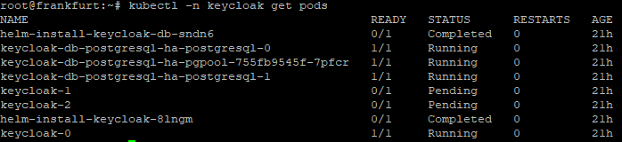
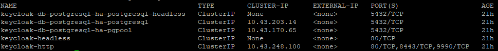

---

## Expose Keycloak service using Ingress

In this section, we are going to create an Ingress object for the `keycloak-http` service. We are using [nip.io](https://nip.io) as a simple DNS resolver for an IP.

``` Bash
# Ingress for Keycloak
echo "apiVersion: networking.k8s.io/v1beta1
kind: Ingress
metadata:
  name: keycloak-ingress-host
  namespace: keycloak
  annotations:
    kubernetes.io/ingress.class: traefik
spec:
  rules:
  - host: keycloak.keeptrack.xyz.209.182.238.54.nip.io
    http:
      paths:
      - backend:
          serviceName: keycloak-http
          servicePort: 80" > keycloak-http-ingress-host.yaml
kubectl create -f keycloak-http-ingress-host.yaml
```

---

## Configuring Keycloak

The Keycloak app should be available at [keycloak.keeptrack.xyz.209.182.238.54.nip.io](http://keycloak.ergo.ch/) and you can use the username and password defined in the configuration of the `Keycloak` Helm chart to login as admin in the admin console [Admin Console](http://keycloak.keeptrack.xyz/auth/admin/) .

You can follow the rest of the setup at [Create a Keycloak realm](https://www.keycloak.org/getting-started/getting-started-kube#_create_a_realm).

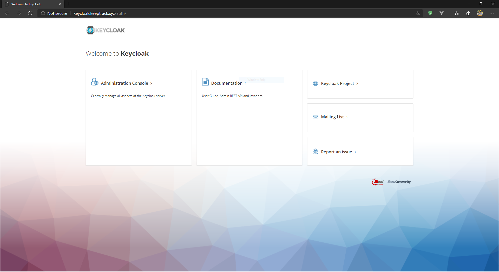
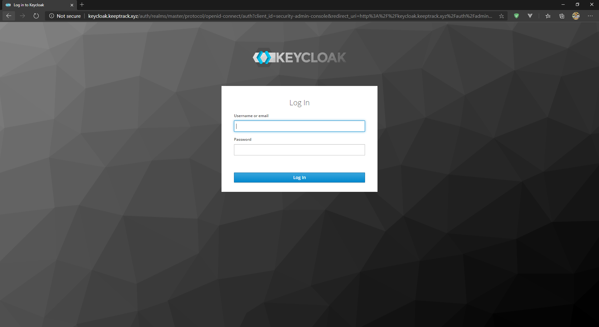
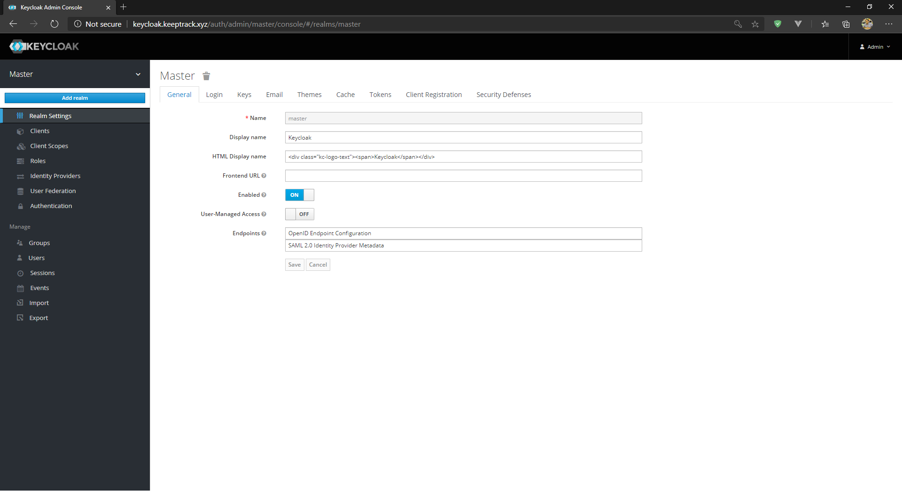
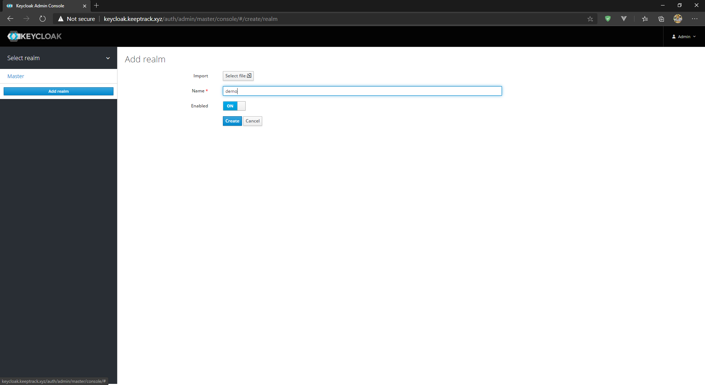
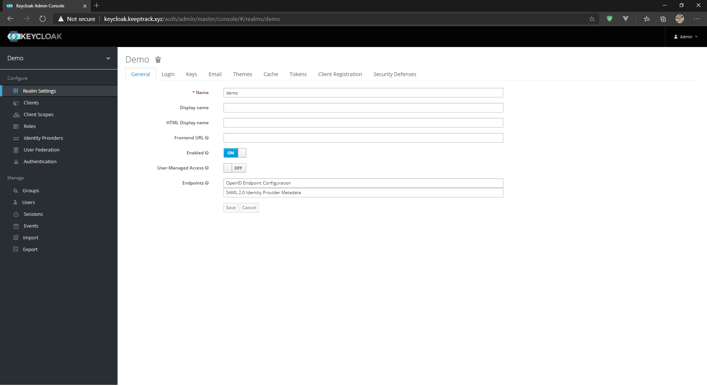
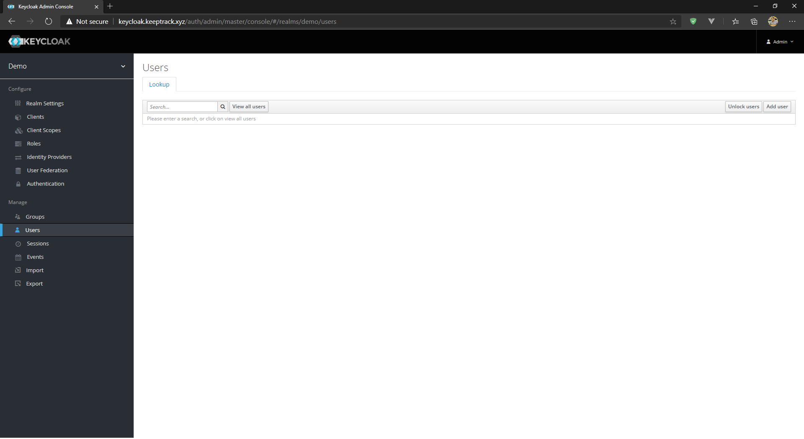
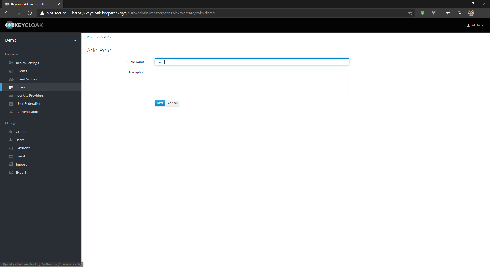
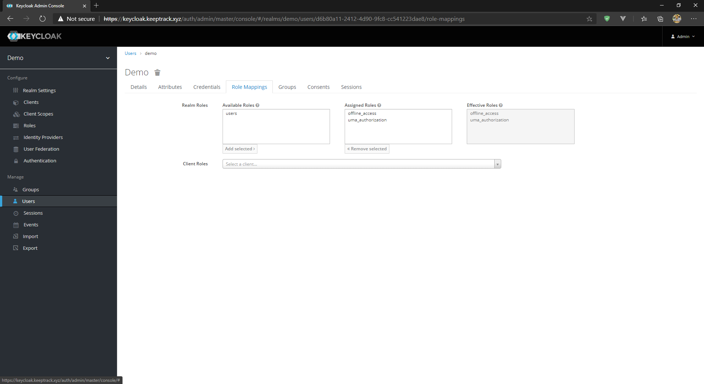
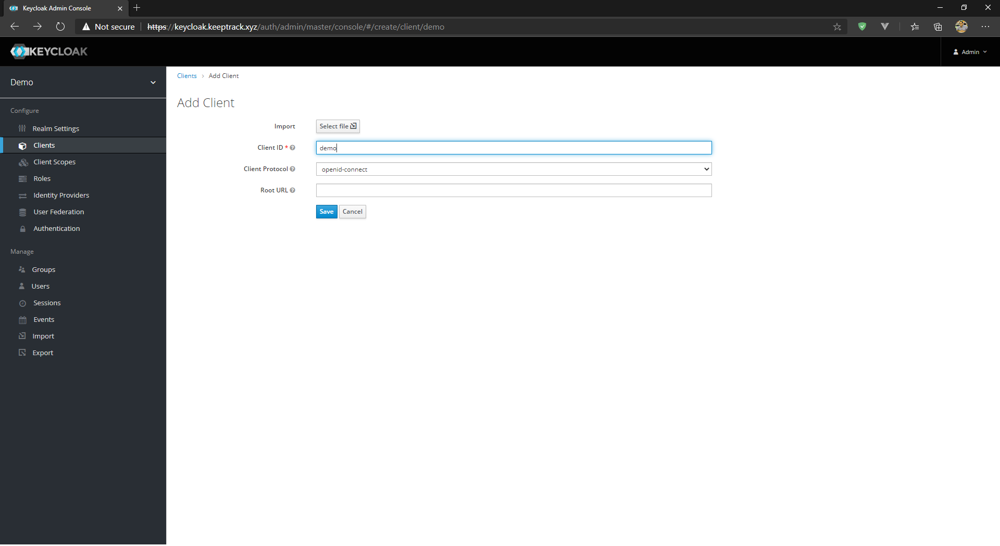
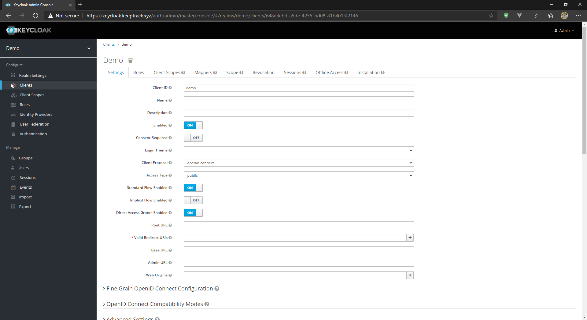

### Add generated certificate to Java store

``` Powershell
keytool -import -alias keycloak-demo -keystore cacerts -file keycloak-demo.cer
java -D"javax.net.ssl.trustStore=./cer/cacerts" -D"CERT=./codes/vanilla-demo/resources/temporary.jks" -jar ./codes/vanilla-demo/target/demo-0.0.1-jar-with-dependencies.jar
```

## Deploy Private Docker Registry as Helm chart

```Bash
# Create Helm controller configuration for Docker registry
# Chart values for Cockroach are available at
# https://github.com/helm/charts/blob/master/stable/docker-registry/values.yaml
echo "apiVersion: helm.cattle.io/v1
kind: HelmChart
metadata:
  name: docker-registry
  namespace: kube-system
spec:
  chart: stable/docker-registry
  valuesContent: |-
    persistence:
      enabled: true
      storageClass: local-path
    ingress:
      enabled: true
      annotations:
        kubernetes.io/ingress.class: traefik
      hosts:
        - registry.keeptrack.xyz.209.182.238.54.nip.io" > registry-chart.yaml
cp registry-chart.yaml /var/lib/rancher/k3s/server/manifests/registry-chart.yaml
```

Don't forget to add the registry to the list of Docker insecure repositories. You can use the Docker Desktop dashboard, or modify the daemon.json file located at `/etc/docker/daemon.json` on Linux or `C:/ProgramData/Docker/Config/daemon.json` on Windows.

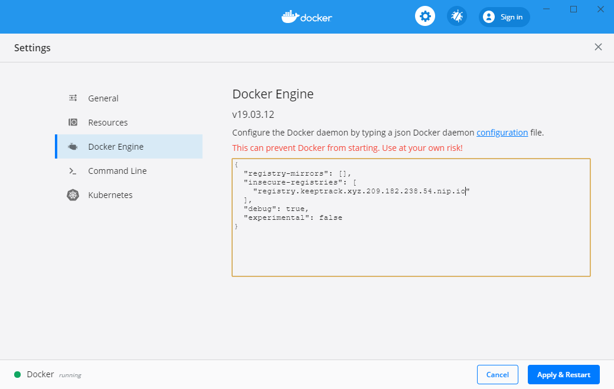

## Modify K3S setup to use the deployed registry

```Bash
DOCKER_REGISTRY_IP=$(kubectl -n kube-system get service/docker-registry -o=jsonpath='{.spec.clusterIP}')
echo "mirrors:
  registry.keeptrack.xyz.209.182.238.54.nip.io:
    endpoint:
      - \"http://$DOCKER_REGISTRY_IP:5000\"" > /etc/rancher/k3s/registries.yaml
```

## Deploy Vanilla-OIDC app

```Bash
kubectl create namespace apps
echo "apiVersion: apps/v1
kind: Deployment
metadata:
  name: vanilla-oidc-deployment
  namespace: apps
  labels:
    app: vanilla-oidc
spec:
  selector:
    matchLabels:
      app: vanilla-oidc
  template:
    metadata:
      labels:
        app: vanilla-oidc
    spec:
      containers:
      - name: vanilla-oidc
        image: registry.keeptrack.xyz.209.182.238.54.nip.io/vanilla-oidc
        imagePullPolicy: Always
        env:
          - name: KEYCLOAK_PATH
            value: \"https://keycloak.keeptrack.xyz.209.182.238.54.nip.io\"
        ports:
        - containerPort: 8080" > vanilla-deployemnt.yaml

echo "apiVersion: v1
kind: Service
metadata:
  name: vanilla-oidc-service
  namespace: apps
spec:
  selector:
    app: vanilla-oidc
  ports:
    - protocol: TCP
      port: 8080
      targetPort: 8080" > vanilla-service.yaml

echo "apiVersion: networking.k8s.io/v1beta1
kind: Ingress
metadata:
  name: vanilla-oidc-ingress
  namespace: apps
  annotations:
    kubernetes.io/ingress.class: traefik
spec:
  rules:
  - host: demo-a.keeptrack.xyz.209.182.238.54.nip.io
    http:
      paths:
      - backend:
          serviceName: vanilla-oidc-service
          servicePort: 8080" > vanilla-ingress.yaml
kubectl create -f vanilla-deployment.yaml -f vanilla-service.yaml -f vanilla-ingress.yaml
```

### Problems with this setup

This setup has introduced 2 problems:

- The need to manually store the Traefik generated TLS certificate inside the Java trust-store.
- Using the application behind Traefik reverse proxy has caused the redirect URL sent with the OAuth request to the Keycloak server to be different than the expected redirect URL.

#### Solution for Problem 1

Using Let's Encrypt which is a nonprofit Certificate Authority providing TLS certificates for a lot of websites. In this example, we are going to use their staging environment to avoid the rate limiting.

```Bash
# Traefik configuration to use Let's Encrypt
echo "apiVersion: helm.cattle.io/v1
kind: HelmChart
metadata:
  name: traefik
  namespace: kube-system
spec:
  chart: stable/traefik
  valuesContent: |-
    rbac:
      enabled: true
    ssl:
      enabled: true
      enforced: true
      sniStrict: true
    acme:
      enabled: true
      email: mafattah@ergo.ch
      domains:
        enabled: true
        domainsList:
          - main: \"*.keeptrack.xyz.209.182.238.54.nip.io\"
          - sans:
              - \"keycloak.keeptrack.xyz.209.182.238.54.nip.io\"
              - \"registry.keeptrack.xyz.209.182.238.54.nip.io\"
              - \"demo-a.keeptrack.xyz.209.182.238.54.nip.io\"
              - \"demo-b.keeptrack.xyz.209.182.238.54.nip.io\"
              - \"traefik.keeptrack.xyz.209.182.238.54.nip.io\"
      persistence:
        storageClass: local-path
    dashboard:
      enabled: true
      domain: traefik.keeptrack.xyz.209.182.238.54.nip.io
      auth:
        basic:
          admin: $apr1$05o7v3mB$kuTMazoKD8MlAjpewllWw.
      ingress:
        tls:
          - hosts:
            - traefik.keeptrack.xyz.209.182.238.54.nip.io
        annotations:
          kubernetes.io/ingress.class: traefik
    metrics:
      prometheus:
        enabled: true
    kubernetes:
      ingressEndpoint:
        useDefaultPublishedService: true
    tolerations:
      - key: \"CriticalAddonsOnly\"
        operator: \"Exists\"
      - key: \"node-role.kubernetes.io/master\"
        operator: \"Exists\"
        effect: \"NoSchedule\"" > traefik-acme-chart.yaml
cp traefik-acme-chart.yaml /var/lib/rancher/k3s/server/manifests/traefik-acme-chart.yaml
```

#### Solution for problem 2

Fix have been applied to the application source code to use the `X-Forwarded` headers instead of normal headers.

---

## Deploying Spring Boot Application with Keycloak

Building on findings from the vanilla app deployment we can create the deployment configuration for the Spring Boot app. This app uses `keycloak-spring-boot-starter` which makes the configuration for the endpoints easy (using properties files) and does not require adding Spring-Security to the list of dependencies.

```Bash
echo "apiVersion: apps/v1
kind: Deployment
metadata:
  name: keycloak-spring-boot-deployment
  namespace: apps
  labels:
    app: keycloak-spring-boot
spec:
  selector:
    matchLabels:
      app: keycloak-spring-boot
  template:
    metadata:
      labels:
        app: keycloak-spring-boot
    spec:
      containers:
      - name: spring-demo
        image: registry.keeptrack.xyz.209.182.238.54.nip.io/spring-demo
        imagePullPolicy: Always
        env:
          - name: KEYCLOAK_PATH
            value: \"https://keycloak.keeptrack.xyz.209.182.238.54.nip.io/auth\"
        ports:
        - containerPort: 8080" > keycloak-spring-boot-deployment.yaml

echo "apiVersion: v1
kind: Service
metadata:
  name: keycloak-spring-boot-service
  namespace: apps
spec:
  selector:
    app: keycloak-spring-boot
  ports:
    - protocol: TCP
      port: 8081
      targetPort: 8081" > keycloak-spring-boot-service.yaml

echo "apiVersion: networking.k8s.io/v1beta1
kind: Ingress
metadata:
  name: keycloak-spring-boot-ingress
  namespace: apps
  annotations:
    kubernetes.io/ingress.class: traefik
spec:
  rules:
  - host: demo-b.keeptrack.xyz.209.182.238.54.nip.io
    http:
      paths:
      - backend:
          serviceName: keycloak-spring-boot-service
          servicePort: 8081" > keycloak-spring-boot-ingress.yaml
kubectl create -f keycloak-spring-boot-deployment.yaml -f keycloak-spring-boot-service.yaml -f keycloak-spring-boot-ingress.yaml
```

---

## Comments

These are some comments

- Some tasks had to be repeated many times due to unknown errors

---

## Failed configurations

``` Bash
# Create Helm controller configuration for Cockroach
# name used in metadata is the name that references the database
# Chart values for Cockroach are available at
# https://github.com/cockroachdb/helm-charts/blob/master/cockroachdb/values.yaml
echo "apiVersion: helm.cattle.io/v1
kind: HelmChart
metadata:
  name: keycloak-db
  namespace: keycloak
spec:
  repo: https://charts.cockroachdb.com/
  chart: cockroachdb
  valuesContent: |-
    tls:
      enabled: true
    storage:
      persistentVolume:
        size: 10Gi
        storageClass: local-path" > cockroach-chart.yaml
cp cockroach-chart.yaml /var/lib/rancher/k3s/server/manifests/cockroach-chart.yaml
kubectl certificate approve keycloak.node.keycloak-db-cockroachdb-0
kubectl certificate approve keycloak.node.keycloak-db-cockroachdb-1
kubectl certificate approve keycloak.node.keycloak-db-cockroachdb-2
kubectl certificate approve keycloak.client.root
# Check cockroach is running
kubectl get pods -n keycloak
# Get IP for database server
kubectl -n keycloack get service keycloak-cockroachdb-public
# Use cockroach secure client toc connect
curl -sfL https://raw.githubusercontent.com/cockroachdb/cockroach/master/cloud/kubernetes/client-secure.yaml -o client-secure.yaml
# Change serviceAccountName: cockroachdb to serviceAccountName: keycloak-db-cockroachdb
# Add namespace: keycloak to metdata
kubectl -n keycloak create -f client-secure.yaml
# Test connection
kubectl -n keycloak exec -it cockroachdb-client-secure -- ./cockroach sql --certs-dir=/cockroach-certs --host keycloak-db-cockroachdb-public:26257
# Create keycloak database
CREATE USER IF NOT EXISTS keycloak;
ALTER USER keycloak WITH PASSWORD 'keycloak';
GRANT admin TO keycloak;
exit
```
